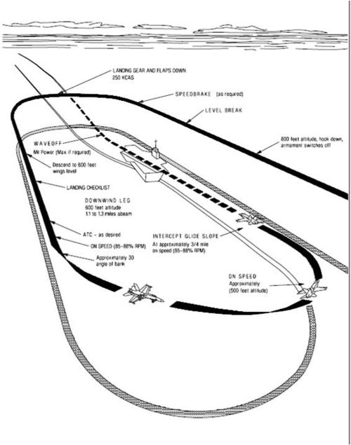
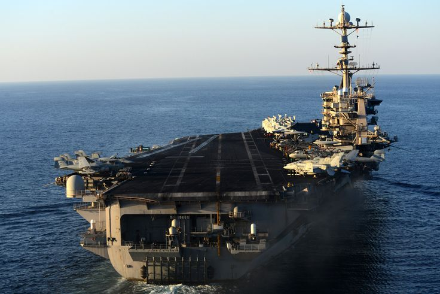

   

   
Page 1
==============

From before the break on in to the groove landing on an aircraft carrier is an intense, focused event. Clara is a call pilots use when landing on the carrier while they are in the groove. It is a radio call made to the Landing Signal Officer (LSO) telling them that the pilot sees the ball of the optical landing system (OLS). The aircraft is a few seconds from slamming into the deck, around three-quarters of a mile out.

|the_ball|

To get in the groove during the day typically the standard VFR (visual flight rules) carrier landing pattern is practiced from the break to the downwind, into the groove, and the wire.

|the_pattern|
    

.. rubric:: Citations
